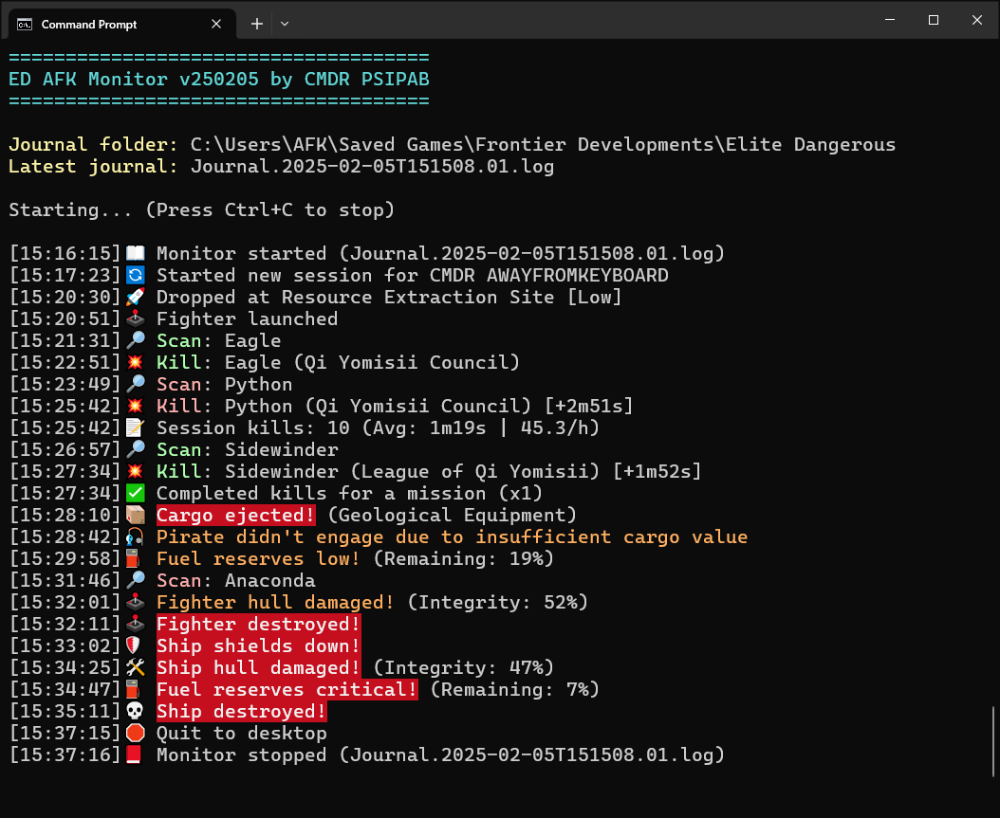
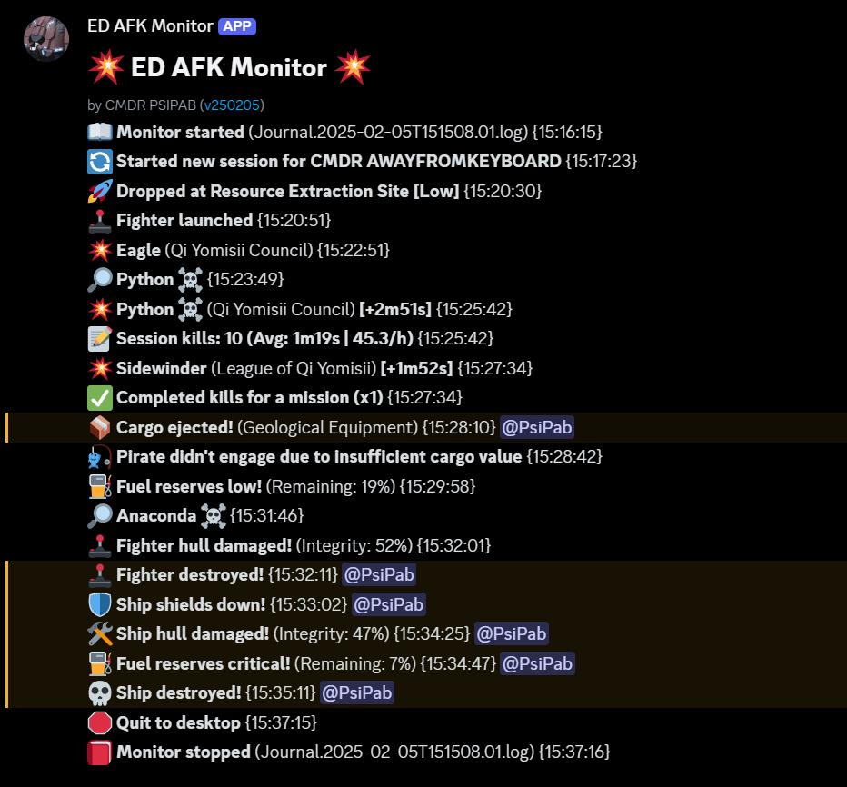

# Elite Dangerous AFK Monitor

Real-time monitoring of Elite Dangerous journal files for logging AFK massacre farming events as they happen. Output is to terminal, Discord channel/thread or Discord with a user ping and each level can be configured on a per-event basis.

| Terminal output | Discord output |
| --- | --- |
|  |  |

*Screenshots of a simulated log being monitored*

## Contents
- [Elite Dangerous AFK Monitor](#elite-dangerous-afk-monitor)
  - [Contents](#contents)
  - [Events and information logged](#events-and-information-logged)
  - [Getting started](#getting-started)
    - [Standalone (EXE) version](#standalone-exe-version)
    - [Python version](#python-version)
  - [Configuring log levels](#configuring-log-levels)
  - [Common Issues](#common-issues)
    - [I get some output to terminal then nothing else](#i-get-some-output-to-terminal-then-nothing-else)
    - [I'm noticing kills in-game that aren't being logged](#im-noticing-kills-in-game-that-arent-being-logged)
    - [Ships scans not all reported / seem wrong](#ships-scans-not-all-reported--seem-wrong)
    - [Hull was damaged but not reported](#hull-was-damaged-but-not-reported)
    - [I ejected cargo manually and got notified](#i-ejected-cargo-manually-and-got-notified)
    - [There are garbled characters in the terminal output](#there-are-garbled-characters-in-the-terminal-output)

## Events and information logged
- Ship scans (by player or by NPC pilot in fighter)
- Bounties (i.e. kills) incl. faction and time since previous
- Kill/bounty/merit summary and average rates every 10 kills
- Mission kills completed and missions remaining
- Ship shields down/restored
- Ship/fighter hull damage
- Ship/fighter destroyed
- Pirates not engaging due to low cargo value
- Cargo stolen
- Fuel reserves low/critical
- Warnings about hostile security forces
- Low kill rate per hour warnings
- Journal inactivity detection (e.g. due to game or network issues)

...plus some other minor things

## Getting started

### Standalone (EXE) version

- Download and extract `afk_monitor_standalone.7z` from [releases](https://github.com/PsiPab/ED-AFK-Monitor/releases) to a folder
- Copy `afk_monitor.example.toml` and rename the copy to `afk_monitor.toml`
- (Optional) For Discord support edit `WebhookURL` and `UserID` under `[Discord]` in `afk_monitor.toml`
- Start Elite Dangerous then run `afk_monitor.exe`

### Python version

Requirements: [Python 3.x](https://www.python.org/downloads/), [discord-webhook](https://github.com/lovvskillz/python-discord-webhook) (optional, required for Discord support)
- Download `Source code (zip)` from [releases](https://github.com/PsiPab/ED-AFK-Monitor/releases) and extract the contents to a folder
- Copy `afk_monitor.example.toml` and rename the copy to `afk_monitor.toml`
- (Optional) For Discord support edit `WebhookURL` and `UserID` under `[Discord]` in `afk_monitor.toml`
- Start Elite Dangerous then double-click `afk_monitor.py` *or* open a terminal and run `py afk_monitor.py`

## Configuring log levels

Each type of event can be set to one of four additive output levels - nothing (0), terminal (1), Discord (2) or Discord plus user ping (3). These can be configured by editing the values in `afk_monitor.toml` under the section `[LogLevels]`. Each event type is described in the config file.

Defaults are intended to be sensible for those new to AFK. For example, scans of hard ships are logged to Discord to aid with avoiding difficult instances.

To reset any log levels to defaults simply copy the appropriate values from `afk_monitor.example.toml`.

## Common Issues

### I get some output to terminal then nothing else

By default AFK Monitor watches your latest journal, so make sure to start it after loading the game or it may process an older journal and produce no further output. If you want to monitor a different journal pass `--fileselect` when starting AFK Monitor and you will be presented with a list of recent journals to chose from.

### I'm noticing kills in-game that aren't being logged

ED does not log all kills/bounties either in-game or to the journal (anywhere from 0-30% are missed). This is a game limitation so there is nothing I can do about it. On the upside, these 'ghost' kills still count towards your mission completions.

### Ships scans not all reported / seem wrong

Scans are recorded in the journal in the same way when targeted by an NPC pilot *or* the player manually. The only reliable data is that a scan was done of a type of ship, so to keep things from being too spammy we only report each ship type once between kills and then reset after a kill.

In addition, if you manually target a type of ship that pirates also use, e.g. system security, those scans will be logged just like any other. For this reason it is best to only use a target key bind for 'select next hostile target' instead if you have AFK Monitor running with scans enabled.

### Hull was damaged but not reported

ED only records hull damage in 20% increments, so if your ship or fighter hull was reduced to 81% for example that wouldn't be reported until it dropped further.

### I ejected cargo manually and got notified

ED's journal does not differentiate between cargo jettisoned by the player or stolen by hatch breaker limpets. As a workaround if you want to get rid of cargo with the script running and not be notified you can use 'Abandon' instead of 'Jettison', or jettison more than one unit at a time.

### There are garbled characters in the terminal output

Windows 10 command prompt doesn't support nice things like colours or emoji. Install and use [Windows Terminal](https://github.com/microsoft/terminal) instead and things will look *a lot* better (see screenshot at top of ReadMe).